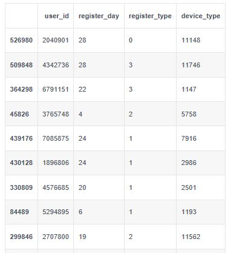
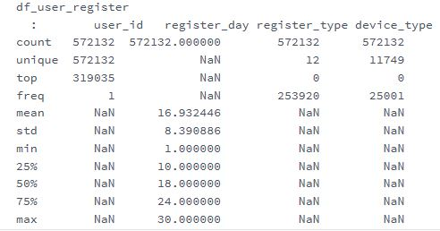

### 2018中国高校计算机大数据挑战赛-快手活跃用户预测

---

　　第一次认真参与的机器学习比赛，复赛B榜rank20+,基本为单LGB模型成绩，单LGB有0.91228auc. 前前后后近两个多月，在这个题目上花了不少精力，在此总结分享一下个人经验[（https://github.com/hellobilllee/ActiveUserPrediction)](http://note.youdao.com/)。本分享将会覆盖使用机器学习算法解决实际业务问题的整套流程，包括**数据分析**，**异常值处理**，**特征工程**，**验证集选择**，**特征选择**，**机器学习模型构建**，**模型参数调节**，**模型融**合等，同时我将总结一下机器学习比赛中常见的一些**提分技巧**。最后，针对本次比赛中一些值得注意的问题以及我没有做好的一些问题做一个思考性的总结。希望本篇分享能够给对机器学习感兴趣的广大萌新提供一个比较全面的指南，如果大家有什么不明白的问题或者发现了什么错误或者有想和大家分享的ideas等等，欢迎留言或者email我（[hibilllee@foxmail.com](http://note.youdao.com/)），欢迎机器学习大佬们提出批评意见，一如既往的向大佬们学习。
　　

---

#### 写在前面
&emsp;&emsp;主要文件为*dataprocesspy*文件夹里面的特征构造函数,*create_feature_v3_parallel.py*（多进程&多线程版），*create_feature_v3_nonp.py*(多进程only版),两个函数特征构造类似，但前者更快，后者占用内存小，使用时综合机器内存与CPU进行合理调用; *model*文件夹里面的*engines.py*,包括*LightGBM, XGBoost, RandomForest,Neural Network, Logistic Regression, Catboost*多个模型;单模性分布在相应名字的文件夹内，如LGB在*lgbpy*文件夹，NN在*nnpy*文件夹. 运行该版本数据处理代码线程并行需要20G以上内存，非并行8G内存便可，可以同时开多个项目加快速度。四个日志文件需存于../input/目录下，共10维特征，输入生成训练数据的*windows*,生成特征维数为458维，特征业务意义可以结合特征生成代码和特征名字进行理解。可以通过调整代码中用于生成区间时许特征的几个for循环内数值大小控制特征生成数量，如只取倒数一周内的活动数、频率和方差等，内存消耗与特征生成数正相关。

---

#### 赛题背景
　　基于“快手”短视频脱敏和采样后的数据信息，预测未来一段时间活跃的用户。具体的，给定一个月的采样注册用户日志（包括注册时间，注册类型，设备类型），以及与这些用户相关的App启动时间，视频拍摄时间和用户活动日志（包括活动时间，观看视频id，作者id，观看页和用户动作），预测这些用户还有哪些在下个月第一周还是活跃用户。预测用户活跃度应该是为了制定个性化的营销策略，赛题传送门[（https://www.kesci.com/home/competition/5ab8c36a8643e33f5138cba4）](http://note.youdao.com/)
　　

---

#### 建模思路
　　预测哪些用户活跃，哪些用户不活跃，这就是一个经典的二分类问题。但现在问题是并没有给定有标签数据，如何做预测。所以第一步，需要我们自己想方法构造标签。具体的，可以使用滑窗法。比如，使用24-30号的数据来标注前23天的样本(label train_set 1-23 with data from 24-30)，用17-23号的数据来标注前16天的样本，可以通过滑动Windows构造很多训练样本。在本赛题中，Windows不应滑得太密，这样会使得产生的样本差异性太小，同时Windows长度不应太小，太小会不能很好地获取用户的长期行为特征。测试集可以是day 1-30，即全量数据， 也可以是15-30的数据，即直接将后半个月不活跃的用户默认为不活跃用户。使用全量用户做测试时，理论上precision可以到1，但recall会比半全量数据小。在这个比赛中，使用全量数据效果要更好。 测试集特征提取区间不能太小（即预测用户为注册日志中的所有用户，但提取用户特征时可以限定一个windows,比如取后半个月中其它日志中的信息），太小precision会不够，可以与训练集窗口值相同，如15，也可以不同（构造window-invariant的特征）。
　　

---

#### 数据分析(dataanalysispy)
　　进入赛题，首先需要了解数据。最基本的， 每一维特征有什么业务意义，每一维特征的count,min,max,mean, std, unique等等基本统计信息。可以使用pandas的sample()函数初步认识数据，如：

```
df_user_register.sample(10)
```

使用pandas 的describe()函数了解数据基本统计信息了。如：
```python
>des_user_register= df_user_register.describe(include="all")
```


可以看出注册时间为30天，即一个月数据，注册类型有12种，设备类型有一千多种。注意对于类别性特征，读取数据时需要将该特征的dtype显示设置为str，然后describe()中参数include设置为all，就可以分别得到类别型和数值型特征的统计信息了。以下为读取注册日志代码：
```python
>user_register_log = ["user_id", "register_day", "register_type", "device_type"]
>dtype_user_register = {"user_id": np.uint32, "register_day": np.uint8, "register_type": np.uint8, "device_type": str}
>df_user_register = pd.read_table("data/user_register_log.txt",header=None,names=user_register_log,index_col=None,dtype=dtype_user_register)
```
可以通过groupby()函数深入的了解特征之间的关系，如查看每一天的注册类型情况:
```python
>print(df_user_register.groupby(by=["register_day"，"register_type"]).size())
```
每一天注册用户数:
```python
>print(df_user_register.groupby(by=["register_day"]).size())
```
或者：

```
df_user_register['register_day'].value_counts()
```


推荐使用seaborn进行更加可视化分析：

```
seaborn.countplot(x='register_day', data=df_user_register)
```

或者：
plt.figure(figsize=(12,5))

```
plt.title("Distribution of register day")
ax = sns.distplot(df_user_register["register_day"],bins=30)
```

可以发现6，7；13，14；21，22，23，24；27，28；这几天注册用户规律性突增，初步判定两天的为周末，21，22，23为小长假，24数据异常增多，有可能有问题，那么可以对24号这一天的数据进行专门分析。

```
sns.countplot(x='register_type', data=df_user_register[df_user_register["register_day"]==24])
```

可以发现，这一天注册类型为3的用户激增，为了验证确实如此，我们可以看看23号的情况。

```
sns.countplot(x='register_type', data=df_user_register[df_user_register["register_day"]==23])
```

看一看16号的情况：

```
sns.countplot(x='register_type', data=df_user_register[df_user_register["register_day"]==16])
```

基本可以判定，24号这一天，注册类型为3的这部分用户有问题，我们可以抓住这个点进一步分析，看看24号这一天，注册类型为3的用户都使用了那些设备类型。

```
df_user_register[(df_user_register["register_day"]==24)&(df_user_register["register_type"]==3)]["device_type"].value_counts()
```


可以发现，24号，注册类型3，设备类型为1，10566，3036的注册用户数异常的多，我们看看23号的数据来验证我们的想法。

```
df_user_register[(df_user_register["register_day"]==23)&(df_user_register["register_type"]==3)]["device_type"].value_counts()
```


可以发现，注册设备类型分布是比较均匀的，没有出现特别多的设备号，所以基本可以判定24号，注册类型3，设备类型为1，10566，3036的注册用户为异常用户。为了进一步验证这部分用户是否活跃，将这部分数据单独提取出来

```
user_outliers = df_user_register[(df_user_register["device_type"]==1)|((df_user_register["register_day"].isin([24,25,26]))&(df_user_register["register_type"]==3)&((df_user_register["device_type"]==10566)|(df_user_register["device_type"]==3036)))]["user_id"].unique().tolist()
print(len(user_outliers))
```
看看这部分用户在24号之后是否出现：
```
df_app_launch[(df_app_launch["user_id"].isin(user_outliers))&(df_app_launch["app_launch_day"]>24)]
```


可以发现，24号之后，这部分用户就不再出现，基本可以判定这部分用户为僵尸用户。我在初赛时单独将这部分用户提交到线上进行过验证，评估结果出现division by zero error，说明precision和recall都为0,即这些用户都是非活跃用户，导致线上计算时出现bug. 确定这部分用户为非活跃用户后，可以在测试时过滤掉这部分用户，然后在提交时将这部分用户活跃概率置零进行合并提交。

另外的对其它三个日志文件进行分析，可以发现app_launch.log中针对每个用户一天只记录一次启动记录，video_create.log和user_activity.log中每天同一用户如果有多测活动的话会有多次记录，如一天拍摄了多个视频，看了多个视频等等。

本赛题数据比较完整，不涉及到缺失值处理的问题，不像蚂蚁金服-支付风险识别比赛，特征值缺失严重，如何处理缺失值大有文章可做。除了传统的try-and-error法进行常规插值，还可以按标签分类分析插值，单变量分析插值，分类聚类分析插值等等。如何妥当处理缺失值，关键还在”分析“二字，将工作做细了，上分就是自然而然的事情。

---

#### 特征构造（*dataprocesspy*）
&emsp;&emsp;一般来说，数据挖掘比赛~=特征构造比赛，特征构造的好坏基本决定了模型的上限。虽然当前深度学习大行其道，降低了人工特征抽取的门槛，但是其网络及参数的设计立了另外一道门槛，同时，深度学习并不是万能的，有些人能想到的特征它并不能学习出来。对于一些非复杂数据结构的数据挖掘竞赛，传统的算法还是执牛耳者，不过熟练掌握各种模型，不管是NN，LR还是LGB，然后进行模型融合，这应该才是进阶大佬的正确姿势。原始数据笼共才10维，如何从这么少的数据当中挖掘出大量信息，构造全面的用户画像，这需要从各个角度进行深入思考。

&emsp;&emsp;我一开始尝试使用规则来做，简单的限定了最后1，2，3，4，5天的活动次数，竟然能够在A榜取得0.815成绩，最初这个成绩在稳居前100以内，而程序运行时间不过几秒钟。所以最初我觉得这个比赛应该是算法+规则取胜，就像中文分词里面，CRF，HMM， Perceptron， LSTM+CRF等等，分词算法一堆，但实际生产环境中还是能用词典就用词典．

&emsp;&emsp;所以我中期每次都是将算法得出的结果跟规则得出的结果进行合并提交，但是中期算法效果不行，所以这么尝试了一段时间后我还是将重心转到算法这块来了。后来我想了想，觉得在这个比赛里面，简单规则能够解决的问题，算法难道不能解决吗？基于树的模型不就是一堆规则吗？算法应该是能够学习到这些规则的，关键是如何将自己构造规则的思路转化为特征。这么一想之后，我开始着手将我用到的规则全部转化为特征，包括最后1，2...10天活动的天数、次数、频率以及窗口中前10,11,12,13,14天活动的rate和day_rate信息，还有后3,5,7,9,11天的gap（活动平均间隔),var，day_var信息，last_day_activity(最近一次活动时间)等等，对app_launch.log和video_create.log可以进行相似操作取特征（具体见GitHub代码（https://github.com/hellobilllee/ActiveUserPrediction/blob/master/dataprocesspy/）。这些特征的重要性在后期的特征选择过程中都是排名非常靠前的特征，其中gap特征是最强特。

&emsp;&emsp;为了处理窗口大小不一致的问题，可以另外构造一套带windows权重的特征(spatial_invariant)；为了处理统一窗口中不同用户注册时间长短不一问题，可以再构造一套带register_time权重的特征(temporal_invariant)；将以上空间和时间同时考虑，可以另外构造一套temporal-spatial_invariant的特征。这套特征构造完后，基本上能够保证A榜0.819以上。B榜我摒弃了带spatial_invariant的特征，因为发现还是固定窗口取特征效果较好，因此temporal-spatial_invariant的特征也不用构造了。后期我又根据众多时序函数（具体可以参考tsfresh[(https://github.com/blue-yonder/tsfresh)](http://note.youdao.com/)这个开源的时序特征构造工具）构造了很多时序特征，因为原始十个特征中4个为时间特征，所以时序特征的构造非常丰富，包括峰值，趋势，能量，自相关性等等很多时序相关性特征。但我感觉这里我也引入了一些噪声特征，这给后期的特征选择带来了一些困难。

&emsp;&emsp;基于单个特征构造的信息我称之为一元特征，如count（rate）,var等等，基于两个以上特征构造的特征我称之为多元特征，可以通过groupby（）进行构造，我开源的代码里面有一些非常常用的、方便简洁的的groupby()["feature_name"].transform()构造多元特征的方法，比讨论区里通过groupby().agg(),然后merge()构造多元特征要方便简洁，这也是我个人结合对pandas的理解摸索出来的一些小trick。一般来说，三元特征已经基本能够描述特征之间的关系了，再多往groupby()里面塞特征会极大降低程序处理速度，对于activity_log这种亿级的数据，基本上就不要塞3个以上特征到groupby()里面了，否则在单机或者科赛平台上可以跑到天荒地老都跑不出来。在这个赛题里面，二元以上的特征可以在register.log中可以针对device_type和register_type构造一些，如
```python
>df_user_register_train["device_type_register_rate"] = (
>df_user_register_train.groupby(by=["device_type", "register_type"])["register_type"].transform("count")).astype(
    np.uint16)
```
这个特征描述的是每一种设备类型下的某一种注册类型有多少人注册。
还可以在activity.log中针对action_type，page， author_id和video_id之间构造一些，但是在这个文件当中构造多元特征会使得生成数据的过程慢很多倍。
在注册日志中有三个特征，即注册时间，注册类型，注册设备，同时这个文件比较小，所以可以在日志内构造三元特征，如：

```
df_user_register_train["register_day_register_type_device_rate"] = (
            df_user_register_train.groupby(by=["register_day", "register_type", "device_type"])[
                "device_type"].transform(
                "count")).astype(np.uint16)
```
这个特征描述的是某天某种注册类型下某种设备类型有多少个，这个特征描述的正好就是上面数据分析过程当中寻找异常数据的过程，因此也是一个强特。

&emsp;&emsp;构造频次（rate)特征时，最好构造相应的频率（ratio)特征，ratio特征可以消除窗口不一致和注册时间不一致的影响，后期我添加了很多基于rate的ratio特征，其中很多也成为强特，比如最后l、2、3、4、5天活动的次数分别除以总活动次数可以构成相对活动特征，可以比rate特征更好的刻画用户的活跃趋势。对于上面那条rate特征，可以构造如下ratio特征：
```
>df_user_register_train["device_type_register_ratio"] = (
>df_user_register_train["device_type_register_rate"] / df_user_register_train["device_type_rate"]).astype(np.float32)
```
这个特征描述的是每一种设备类型下注册类型的比例。其中df_user_register_train["device_type_rate"]  （表示每一种设备类型数有多少）可以通过如下代码构造：
```
>df_user_register_train["device_type_rate"] = (
>df_user_register_train.groupby(by=["device_type"])["device_type"].transform("count")).astype(np.uint16)
```
&emsp;&emsp;特征构造落脚点最好是有一定的业务意义，在本赛题当中，就是要从能够完善用户画像的角度着手，我从10个原始特征当中构造的458特征，每一个都有比较明确实际意义，虽然有些特征的相关性可能很高，但即使不进行相关性特征的去除或者分类，特征间相关性并不一定会又碍于基于树模型的算法进行建模，如XGBoost其实能够很好的处理相关性比较高的特征集。但是特征多了，噪声特征也会增多，这就给特征选择增加了不少难度。有一些自动化的特征构造工具，比如featuretools[(https://github.com/Featuretools/featuretools)](http://note.youdao.com/),大家可以了解一下，但是，这个东西，说实话，比手动构造特征效果差多了，主要是它会构造出一些乱起八糟的特征，导致最后特征选择都没法拯救模型效果，而且数据量一大，就不像手动一样可以做代码优化了，但是，里面的一些思想还是可以参考参考的。

&emsp;&emsp;讲讲业务特征，比如有的主播可能每周固定时间开播，那么这种周期性可以通过对时间模7然后取pair对的方式构造特征描述，用户的每一种动作类型，在每一个页面的次数及比例，都可以单独提取出来作为特征。总的来说，从基本统计特征，时序特征，日志内交互特征，日志间交互特征，业务特征这几方面去思考，用户画像已经刻画的比较全面了。

---
#### 验证集选择
&emsp;&emsp;在数据挖掘比赛中，找到一个可靠的验证集基本就成功了一大半。可是这个比赛中我还是没能找到一个靠谱的验证集，从周周星的分享来看，应该大部分人也是没有找到可靠的验证集的。这个赛题可靠的验证集确实不好找，更有可能的是不存在单一的可靠验证集，所谓单一的验证集是指单纯使用某个固定区间内的数据当验证集。

&emsp;&emsp;周周星分享的都是使用8-23号的数据当验证集，可是这个根本就不靠谱，即使1-16号训练集和验证集线下同时上分，线上还是有可能降分，线下降分线上可能上分也有可能降分，这个平衡点很难把握。对8-24采样进行验证波动情况很大，不靠谱；对8-24号每一天采样固定比例用户当验证及波动也很大，不靠谱；取17-23号的用户当验证机，线上线下还是不同步。照理来说，越靠近后面的数据与线上应该相似，比如17-23号的用户，同时对每一天用户都部分采样，比如如下采样函数：

```
# sample data from each day given a dataframe with user_id and day feature within a window
def get_stratified_sample(df, sample_target="user_id", reference_target="app_launch_day",
                          sample_ratio=0.2):
    df = df.astype(np.uint32)
    reference_target_ls = df[reference_target].unique().tolist()
    target_sample = []
    for i in reference_target_ls:
        # print("get users in day {}".format(i))
        target_sample.extend(df.loc[df[reference_target] == int(i)][sample_target].drop_duplicates().sample(frac=sample_ratio).tolist())
    del df
    return list(set(target_sample))
```
先把17-23号或者8-23号的用户和启动时间取出来形成df，可以存到磁盘上，然后从这些用户中分天采样做验证集。但是，线上线下还是不同步啊不同步，有可能是我没有非常细致的记录每次线下和线上成绩的情况，缺乏分析，导致有可能忽视了其中某种相关性。

&emsp;&emsp;赛后我重新回顾了一波ijacai第二名大佬的验证集构造思路，发现可以使用双验证集方式，从8-23号数据中部分采样做验证集1，从17-23号数据中部分采样做验证集二，在这两个验证集上做特征选择和者参数调节有可能能取得不错的效果。我特征选择时参考的训练集和验证集这个双验证集模型，看效果并不是很好，要学习的还有很多很多啊。

---
#### 特征选择
&emsp;&emsp;特征选择真的很重要。随便变动一下特征相关性筛选器阈值，线上波动几个万。可能是初涉比赛，又意外发现自己特征构造能力还如此之强（欠揍脸），所以特征选择方法探索也是本次比赛的重点。

&emsp;&emsp;scikit-learn里面已经包含了不少的特征选择方法，基于统计或者MI的单一变量特征选择方法，RFECV, L1-based,Tree-based。基于基础统计的单一变量特征选择方法不靠谱，很少用，基于MI的还可以，RFECV对于特征多数据量大的情况谨慎使用，特别是没有找到靠谱的验证集的情况下，靠谱程度降两级，L1-base的可以打辅助吧。

&emsp;&emsp;感觉大家用集成模型比较多，所以用tree-based的方法辅助特征选择也是最常见的，但想XGB，LGB里面，特征重要性获得标准有几个可选项，包括split(weight)，gain,cover（split weighted by the number of training data points that go through those splits）之类。scikit-learn warpper里面默认使用split做特征重要性判定标准，但是特征分裂次数感觉很不靠谱啊，很有可能很弱的连续大区间的数值型特征比很强的01特征分裂次数要多的多，因为这些基于树模型的方法分叉方式就是选定特征，然后选择划分区间，基于split的方法明显偏向于这个大区间连续数值型特征。所以判定特征重要性最好还是用gain吧，这个gain应该指损失函数泰勒二阶展开后一二阶导综合一块计算得到的一个值，训练损失减少增益，就这么称呼它吧。

&emsp;&emsp;下面我给大家推荐一个可能比gain更靠谱的可以与tree模型结合到一块使用的特征重要性判定工具，shap[(https://github.com/slundberg/shap](http://note.youdao.com/))。评判特征重要性有两个点，一个是连续性，就是说不同特征在不同模型间的相对重要性是一致的，二是准确性，就是说这种评判方法需要得到一个可以量化的有一定意义的一个指标，从这两点来看，上面tree-based的模型中的三种方式都不连续，但是shap可以保有上面两个性能，有兴趣的同学可以去研究研究，看看相关的论文，这个也是新近出来的东东。

&emsp;&emsp;我觉的可以一试的特征选择方法还有feature selection with null importance, 这种特征选择方法简单来说就是随机将要预测的标签打乱，每次打乱都使用训练一次模型，然后综合考虑N次模型特征重要性排序变化情况，一般来说，那些噪声特征对于将标签打乱是不太敏感的，所以他们的特征重要性值波动不会太大，然后可以根据这个性质去剔除噪声特征。

---
#### 机器学习模型构建
&emsp;&emsp;机器学习模型构建应该是整个机器学习问题解决方案pipeline当中最容易的了，但是前提是你要对这些常见的机器学习方法有一定的了解。感觉我的github中包含的几个模型应该是监督学习特别是分类问题中应用最广泛的一些模型了，LR，RF， SVM，XGBoost,LightGBM,Catboost, DNN，当然还有LSTM，CNN，FFM，deepffm, 最后面两个还没有实际使用过，但是看到群里不少大佬都有用，看了一下原理，感觉速度不快，效果也一般吧，好像在CRT或CVR当中使用的比较多，比较适合于稀疏特征数据。如果特征苦手，可以尝试一下这些模型和深度模型。

&emsp;&emsp;什么聚类模型，回归模型，强化学习模型（这里是一片广阔天地，微笑脸）我就不再这里讲了。统计机器学习（李航），机器学习（周志华，西瓜书），深度学习（Bengio etc.）没事可以多翻翻。附上几个常用框架链接吧，我看竞赛群里有时还冷不丁的有人求LightGBM参数连接（黑人问号脸）：

传统机器学习框架scikit-learn: [http://scikit-learn.org/stable/user_guide.html](http://note.youdao.com/)

快速上手深度框架keras:[https://keras.io/](http://note.youdao.com/)

热门深度框架:

tensorflow(google): [https://www.tensorflow.org/tutorials/?hl=zh-cn](http://note.youdao.com/)

Pytorch(facebook): [https://pytorch.org/tutorials/](http://note.youdao.com/)

NLTK(MS): [https://www.nltk.org/](http://note.youdao.com/)

MXNET(Amazon): [https://mxnet.apache.org/tut
orials/index.html](http://note.youdao.com/)

LightGBM: [https://lightgbm.readthedocs.io/en/latest/](http://note.youdao.com/)

XGBoost:[https://xgboost.readthedocs.io/en/latest/](http://note.youdao.com/)

Catboost: [https://tech.yandex.com/catboost/doc/dg/concepts/about-docpage/](http://note.youdao.com/)

分布式计算框架spark:[https://spark.apache.org/](http://note.youdao.com/)

---
#### 参数调节
&emsp;&emsp;到了模型调参阶段那么整个pipeline差不多要收尾了。如果你的验证集靠谱，那就使用下面即将介绍的一些自动调参工具吧，如果验证集不靠谱，那么我想说，还是不要浪费时间调参了，还不如手动调一调，看看所调参数对线上成绩的影响，然后根据反馈调整参数，甚至调整特征，甚至训练集，what?手动调参还有这种骚作用？是的，手动调参有助于你对问题的理解，比如LGB中subsample调大效果会上升，那很有可能你增加训练集也可提升效果，如果你增大col-sample-by-tree可以提升效果，那么很有可能你不必剔除太多相关性很大的特征，当然，具体问题具体分析，因为，调参就是这么玄学。下面介绍几种常见的调参方法：

GridSearchCV:暴力调参，scikit-learn里有

RandomSearchCV:随缘调参，scikit-learn里有

BayesianOptimization: 

hyperopt: [https://hyperopt.github.io/hyperopt/](http://note.youdao.com/)

BayesianOptimization: [https://github.com/fmfn/BayesianOptimization](http://note.youdao.com/)

skopt: [https://scikit-optimize.github.io/](http://note.youdao.com/)

btb: [https://github.com/HDI-Project/BTB](http://note.youdao.com/)

可以尝试一下最后一种调参方式，应该很少有人了解这个工具，个人比较推荐，可以打印调参过程中每组参数其效果。

---

#### 上分因素
影响上分的因素我总结了一下，主要有以下几个：
1. data window: 训练数据的划分。前排有的同学用1-19..23做训练，用1-30做测试，使用的是变长的windows;有的同学用1-16，8-23做训练，用15-30做预测，使用的是变长的windows。两种不同的划分方式都能取得不错的成绩，说明windows的划分是很灵活的，但有的同学使用定长的window好，有的使用变长的window好，其原因有二，一是构造的特征适应性，二是训练集的组合情况（决定了训练数据的多少以及分布）。我A榜使用的1-17..1-23七个窗口的训练集，1-30为测试集；B榜发现使用1-17，1-20，1-23三个窗口训练时效果会好点，同时加入a榜数据。复赛前排大多使用1-16和8-23训练，1-30预测，也有增加一个1-9的训练集的，我随了大流，用的长window两训练集，没有尝试其它方式。
2. parameter tuning: 调参，玄学？初赛前期我尝试了多次使用hyperopt和BayesSearchCV()进行调参，但是效果都没有不调参好，所以后来我就基本不调参了，只稍稍调整一下LGB当中树的个数，叶子树固定为4，多了就过拟合（后期就是固定使用LGB了）。复赛也没调参，手动变化了一下参数，影响还是很大的，还是因为没有找到的好的验证集啊，导致调参没有用武之地。
3. model: 尝试了NN，DNN，加Gaussian噪声的NN，没能发挥出NN的效果，提交了一个NN的结果0.9107左右，可以说是很差了。Catboost, LR, XGBoost, 都跑了结果，提交了Catboost和XGBoost，比LGB一般要查一两个万。 Catboost和NN有时候效果挺好，但太容易过拟合了;XGB从个人使用的情况来看，一般干不过LGB，而且速度跟不上;LR我一般用来验证新想法是否合适，如新加的特征是否有用，新的数据划分方式是否合适，删除那些特征合适等等。一般来说，LR适合干这类事情，一是其速度快，二是其模型简单，能够获得比较靠谱的反馈，而且其结果也不错，但是对于这类成绩需要精确到小数点后七位数字的比赛来说，显然就不合适了，在实际生产环境中倒是非常不错的选择。
4. data merging: 训练集构造特别重要，从四个日志文件中划分好窗口获得特征后，如何merge需谨慎。A榜在将四个文件merge的时候需要仔细思考merge的顺序，B榜要思考是否可以A榜训练数据。考虑到register文件和launch文件所含的用户数量一致，即注册的用户都至少启动了一次，而且没有launch日志记录的缺失，所以可以先将register获得的特征merge到launch获得特征中去（其实这里merge顺序可以对调，因为两者构造特征去重后数量一致，而且用户一致），然后可以将从video_create日志中获得特征merge到之前已经merge好的数据中去，最后将activity日志merge到上一个merge好的数据当中去（activity中虽然数据量大，但是构造好特征之后去重比launch要少，因为不是所有的用户都有活动）。这样merge之后最终获得数据量即窗口中注册用户量，特征维数为从四个日志文件中所构造特征维数之和。B榜的时候，我分别尝试了只用A榜数据训练；只用B榜数据训练；使用AB榜的数据一起训练；并线上线下分别验证了效果，发现使用AB榜数据一起训练时效果最好，并且窗口划分为1-17，1-21，1-23, 测试时用B榜1-30天的数据。
5. feature engineering:初赛300+特征，复赛450+特征，不选择特征的话成绩其实也还不错，但是上不了前排。 复赛将特征根据相关性分为了四波，单独用每一波特征训练效果其实都挺不错的，有一次提交的结果还创造了我最好的单模成绩，一度蹭到了13名，离获奖只有一步之遥，但后期模型融合乏力，只能说，自己也该好好学一学如何进行模型融合了。
　　尝试过在构造的特征之上通过PCA，NMF，FA和FeatureAgglomeration构造一些meta-feature，就像stacking一样。加上如此构造的特征提交过一次，过拟合严重，导致直接我弃用了这种超强二次特征构造方式。其实特征的构造有时也很玄学，从实际业务意义角度着手没错，但是像hashencoding这种，构造出来的特征鬼知道有什么意义，但是放到模型当中有时候却很work,还有simhash, minhash,对于短文本型的非数值型特征进行编码，你
6. model fusing
使用AUC作为评价指标，那么如何融合其实大有文章可作。推荐看这片文章[（https://mlwave.com/kaggle-ensembling-guide/）](http://note.youdao.com/)，该文章应该把如何做模型融合讲的比较全了。简单加权，rank加权（使用于不同模型之间的融合，仅AUC），平方加权（适用于相关性大的模型，AUC），虽然我这次模型融合没做好，但是。。希望下次做好吧。。。
7. 验证集： 验证集验证集验证集，重要的事情多说几遍。

#### trick
1. 构造特征的时候指定特征数据类型（dtype)可以节约1/2到3/4的内存。pandas默认整形用int，浮点用float64，但是很多整形特征用uint8就可以了，最多不过uint32，浮点型float32就能满足要求了，甚至float16也可以使用在某些特征上，如果你清楚你所构造的特征的取值范围的话。
2. 读取过后的某些大文件后面不再使用的话及时del+gc.collect(), 可以节省一些存储空间。如果数据中间不使用但最后要使用的话，可以先保存到本地文件中，然后del+gc.collect()，最后需要使用的话再从文件中读取出来，这样处理时间会稍长点，但是对于memory 资源有限的同学还是非常有用的。（所谓的特征分块磁盘存储）
3. 使用groupby()+transform() 代替groupby().agg()+merge(）
4. 加入spatial-invariant，ratio特征
5. 统计最后或者某个日期之前活动的频率特征时可以使用apply（）结合如下函数：

```
def count_occurence(x, span):
    count_dict = Counter(list(x))
    # print(count_dict)
    occu = 0
    for i in range(span[0], span[1]):
        if i in count_dict.keys():
            occu += count_dict.get(i)
    return occu
```
span为你想要统计的某个区间。更多特征提取函数详见github[（https://github.com/hellobilllee/ActiveUserPrediction/blob/master/lgbpy/lgb_v16.py)](http://note.youdao.com/)
6. 提取每一个page，action比例单独做特征，page-action,action-page交互特征，详间数据处理函数（这里面有一些骚操作）

#### 写在后面
　　通过这次比赛，学到的东西还是挺多的，主要是群里气氛很活跃，不像加的别的几个竞赛群基本没有讨论，很多大佬很有才的，还乐于分享，所以整个比赛过程还是很愉快的，但我感觉是真有一些演员，套路很深，感觉不是很好。这次比赛，虽然卯足了劲想冲个前10，但是，前排大佬还是强啊，lambda大佬复赛是真的稳，比大古还稳，等一波大佬开源，然后看看决赛答辩，本次比赛就算告一段落了。虽然是初次打比赛，但下一次比赛估计要等一段时间了，因为要秋招啊，先解决饭碗问题吧，秋招后再战秋名山。
